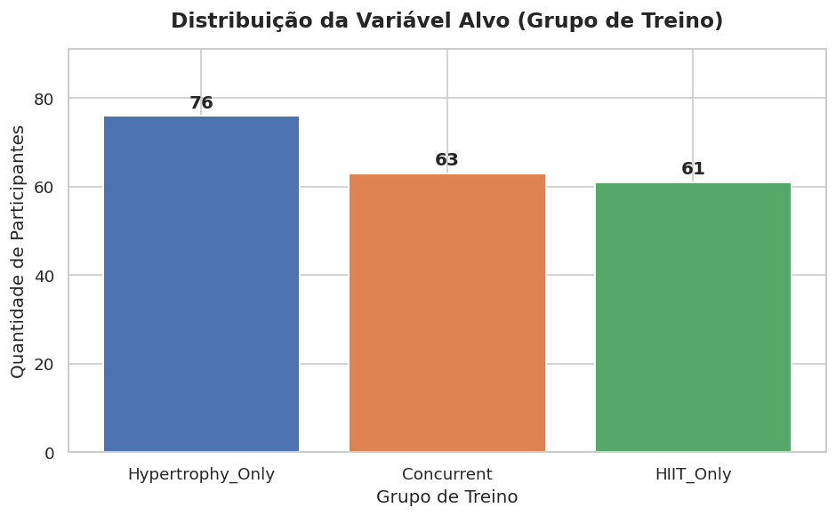
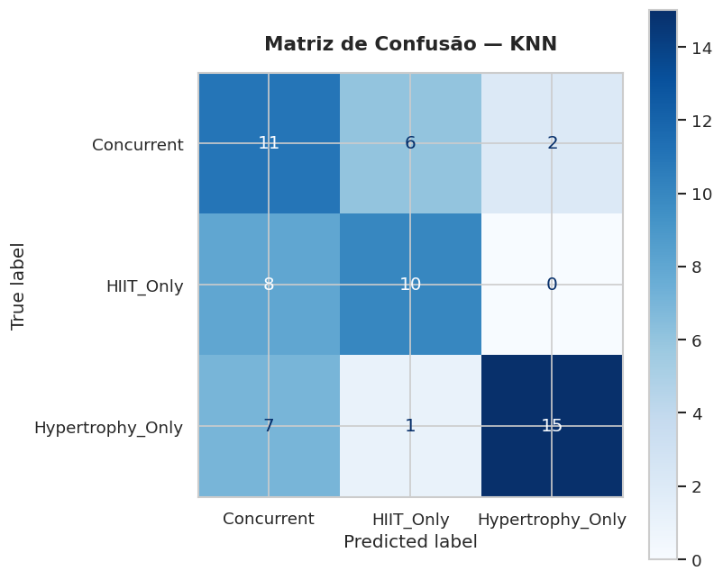
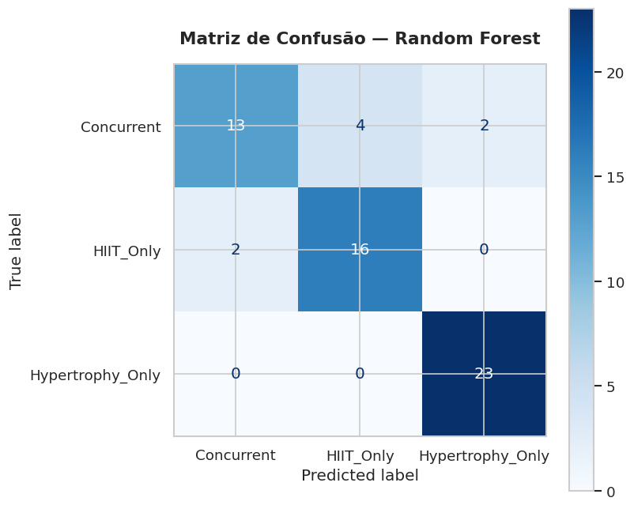
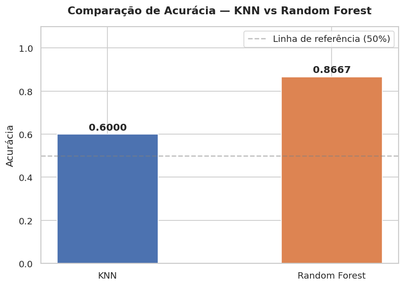
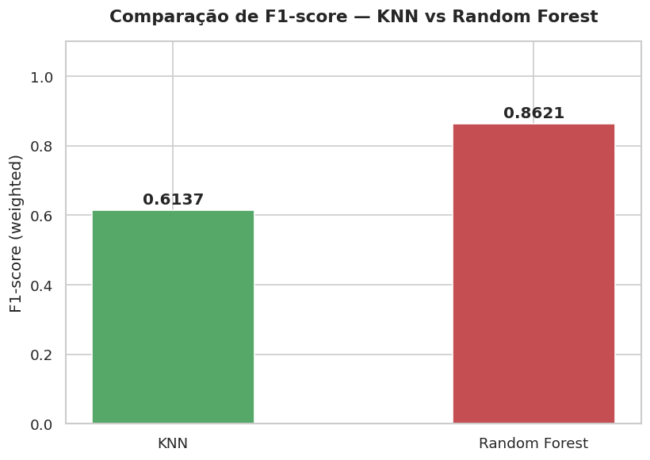

# Disciplina de Inteligência Artificial , Professor Munif , Unicesumar 2026

---
Leonardo Xavier Rodrigues RA: 23178963-2

---

# Comparação de Modelos de IA para Classificação de Tipos de Treino Físico
## HIIT vs Hipertrofia vs Treino Concorrente

**Dataset:** HIIT vs Hypertrophy Workout Gains — Kaggle  
**Modelos:** KNN (K-Nearest Neighbors) e Random Forest  
**Método de Avaliação:** Holdout (70% treino / 30% teste)

---

## Sumário

1. [Tema do Projeto](#1-tema-do-projeto)
2. [Problema Investigado](#2-problema-investigado)
3. [Hipótese](#3-hipótese)
4. [Dataset](#4-dataset)
5. [Variável Alvo](#5-variável-alvo)
6. [Pré-processamento](#6-pré-processamento)
7. [Holdout](#7-holdout)
8. [Modelos Treinados](#8-modelos-treinados)
9. [Resultados e Métricas](#9-resultados-e-métricas)
10. [Gráficos](#10-gráficos)
11. [Comparação dos Modelos](#11-comparação-dos-modelos)
12. [Conclusão](#12-conclusão)
13. [Estrutura do Projeto](#13-estrutura-do-projeto)
14. [Como Executar](#14-como-executar)

---

## 1. Tema do Projeto

Comparação de modelos de Inteligência Artificial — **KNN** e **Random Forest** — para a classificação do tipo de treino físico praticado por indivíduos, com base em variáveis fisiológicas e de desempenho, utilizando o dataset *HIIT vs Hypertrophy Workout Gains*.

---

## 2. Problema Investigado

Com base em dados fisiológicos e de desempenho físico — como idade, gênero, percentual de gordura corporal inicial e final, massa magra, variação do VO2 Máx, taxa de adesão ao treino e condição dietética — **é possível que um modelo de IA classifique corretamente o grupo de treino** ao qual o participante pertence: HIIT, Hipertrofia ou Treino Concorrente?

---

## 3. Hipótese

> O modelo **Random Forest**, por sua capacidade de combinar múltiplas árvores de decisão e lidar bem com dados heterogêneos e problemas multiclasse, tende a superar o **KNN** nesta tarefa de classificação. Espera-se que o KNN seja mais sensível à escala das variáveis e aos ruídos presentes em dados fisiológicos, enquanto o Random Forest capture melhor os padrões não lineares entre as features.

---

## 4. Dataset

| Atributo | Informação |
|---|---|
| **Nome** | HIIT vs Hypertrophy Workout Gains Dataset |
| **Origem** | Kaggle |
| **Registros** | 200 participantes |
| **Colunas** | 12 |
| **Valores Nulos** | Nenhum |

### Descrição das Colunas

| Coluna | Tipo | Descrição |
|---|---|---|
| Participant_ID | str | Identificador único — removido no pré-processamento |
| Age | int | Idade do participante (18–54 anos) |
| Gender | str | Gênero (Male / Female) |
| Group | str | **Variável alvo** — tipo de treino |
| Duration_Weeks | int | Duração em semanas (constante: 12) — removida |
| Compliance_Rate | float | Taxa de adesão ao treino (%) |
| Initial_Body_Fat_Pct | float | Percentual de gordura corporal inicial |
| Final_Body_Fat_Pct | float | Percentual de gordura corporal final |
| Initial_Lean_Mass_kg | float | Massa magra inicial (kg) |
| Final_Lean_Mass_kg | float | Massa magra final (kg) |
| VO2_Max_Change_Pct | float | Variação percentual do VO2 Máx |
| Dietary_Condition | str | Condição dietética (Deficit / Surplus / Maintenance) |

---

## 5. Variável Alvo

A coluna **Group** foi definida como variável alvo, com três classes:

| Classe | Quantidade | Descrição |
|---|---|---|
| Hypertrophy_Only | 76 | Treino exclusivo de hipertrofia |
| Concurrent | 63 | Treino combinado (HIIT + Hipertrofia) |
| HIIT_Only | 61 | Treino exclusivo de HIIT |

O problema é de **classificação multiclasse** com 3 categorias.

---

## 6. Pré-processamento

1. **Remoção de colunas irrelevantes:** Participant_ID e Duration_Weeks
2. **Codificação de variáveis categóricas** com LabelEncoder (Gender e Dietary_Condition)
3. **Verificação de valores nulos:** nenhum encontrado
4. **Normalização** com StandardScaler nas features de entrada
5. **Separação:** X (9 features) e y (variável alvo codificada)

---

## 7. Holdout

| Conjunto | Proporção | Registros |
|---|---|---|
| Treino | 70% | 140 |
| Teste | 30% | 60 |

Parâmetro `stratify=y` utilizado para proporção equilibrada entre classes. `random_state=42` para reprodutibilidade.

---

## 8. Modelos Treinados

### KNN — K-Nearest Neighbors
- Classifica novos pontos pela classe predominante entre os K vizinhos mais próximos
- Parâmetros: n_neighbors=5, metric=minkowski (Euclidiana)

### Random Forest — Floresta Aleatória
- Ensemble de 100 árvores de decisão com votação majoritária
- Parâmetros: n_estimators=100, random_state=42

---

## 9. Resultados e Métricas

### Tabela Comparativa

| Modelo | Acurácia | Precisão | Recall | F1-score |
|---|---|---|---|---|
| KNN | 0.6000 (60.00%) | 0.6487 | 0.6000 | 0.6137 |
| **Random Forest** | **0.8667 (86.67%)** | **0.8671** | **0.8667** | **0.8621** |

### Relatório KNN

```
                   precision  recall  f1-score  support
       Concurrent       0.50    0.47      0.49       19
        HIIT_Only       0.61    0.72      0.66       18
 Hypertrophy_Only       0.70    0.61      0.65       23
         accuracy                         0.60       60
```

### Relatório Random Forest

```
                   precision  recall  f1-score  support
       Concurrent       0.84    0.84      0.84       19
        HIIT_Only       0.88    0.83      0.86       18
 Hypertrophy_Only       0.88    0.91      0.90       23
         accuracy                         0.87       60
```

---

## 10. Gráficos

### Distribuição da Variável Alvo


### Matriz de Confusão — KNN


### Matriz de Confusão — Random Forest


### Comparação de Acurácia


### Comparação de F1-score


### Comparação Completa


---

## 11. Comparação dos Modelos

O **Random Forest** superou o **KNN** em todas as métricas:
- Acurácia: 86,67% vs 60,00% — diferença de **26,67 pontos percentuais**
- F1-score: 0.8621 vs 0.6137
- O KNN teve maior dificuldade com a classe Concurrent, que mistura características das outras duas classes
- O Random Forest classificou as três classes com precisão e recall acima de 83%

---

## 12. Conclusão

### Modelo Vencedor: Random Forest

**Por que o Random Forest se saiu melhor?**
- Ensemble de 100 árvores reduz variância e overfitting
- Não depende exclusivamente de distâncias como o KNN
- Captura padrões não lineares entre variáveis fisiológicas
- Lida melhor com a ambiguidade do treino Concorrente

### Vantagens e Limitações do KNN

| Vantagens | Limitações |
|---|---|
| Simples e intuitivo | Sensível à escala das variáveis |
| Sem treinamento explícito | Custo alto em datasets grandes |
| Adapta-se bem a fronteiras complexas | Sensível a ruídos e outliers |

### Vantagens e Limitações do Random Forest

| Vantagens | Limitações |
|---|---|
| Alta acurácia em geral | Difícil interpretação (caixa preta) |
| Robusto a overfitting | Maior custo computacional |
| Lida bem com multiclasse | Menos eficaz em datasets muito pequenos |

### Limitações do Dataset
- Apenas 200 registros — dataset pequeno
- Duration_Weeks constante (12 semanas para todos)
- Possível caráter sintético do Kaggle

### Melhorias Futuras
- Testar SVM, Gradient Boosting, XGBoost, Redes Neurais
- Aplicar validação cruzada k-fold
- Otimizar hiperparâmetros com GridSearchCV
- Explorar SHAP values para interpretabilidade

---

## 13. Estrutura do Projeto

```
projeto-ia-hiit-vs-hipertrofia/
├── dataset/
│   └── hiit_vs_hypertrophy.csv
├── models/
│   ├── knn_model.pkl
│   ├── random_forest_model.pkl
│   ├── scaler.pkl
│   └── label_encoder.pkl
├── graphs/
│   ├── distribuicao_alvo.png
│   ├── matriz_confusao_knn.png
│   ├── matriz_confusao_random_forest.png
│   ├── comparacao_acuracia.png
│   ├── comparacao_f1_score.png
│   └── comparacao_todas_metricas.png
├── notebook/
│   └── trabalho_ia.ipynb
├── README.md
├── trabalho_ia.pdf
└── requirements.txt
```

---

## 14. Como Executar

```bash
# Instalar dependências
pip install -r requirements.txt

# Abrir o notebook
cd notebook
jupyter notebook trabalho_ia.ipynb
```

---

*Trabalho desenvolvido para a Disciplina de Inteligência Artificial — Unicesumar 2026*  
*Professor: Munif*
